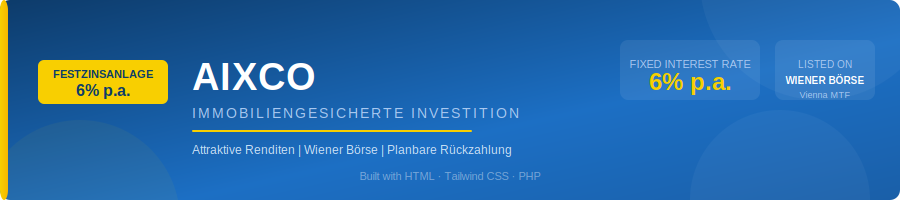

<p align="center">
  
</p>

# AIXCO — Festzinsanlage Landing Page

A professional investment landing page for **AIXCO-Festzinsanlage**, a real estate-secured fixed-rate investment product listed on the **Wiener Börse (Vienna MTF)**. The page is designed to inform potential investors and capture inquiries through a lead form.

---

## Features

- **6% p.a. Fixed Interest Rate** — attractive returns clearly communicated
- **Lead Capture Form** — inquiry form with PHP mail backend
- **Responsive Design** — mobile-first layout using Tailwind CSS
- **Thank You State** — post-submission feedback for users
- **Fact Sheet Download** — downloadable PDF information sheet
- **Key Benefits Section** — highlights fixed returns, stock exchange listing, and capital repayment
- **Legal Disclaimer** — risk notice and regulatory footer

---

## Tech Stack

| Technology | Purpose |
|---|---|
| HTML5 | Page structure |
| Tailwind CSS (CDN) | Styling & responsive layout |
| Vanilla JavaScript | Form handling & UI interactions |
| PHP | Server-side form submission via email |
| Google Fonts (Inter) | Typography |

---

## Project Structure

```
axico/
├── index.html          # Main landing page
├── images/
│   ├── AIXCO-Logo.svg      # Brand logo
│   ├── Banner-Image.jpg    # Hero section background
│   ├── fact-sheet.jpeg     # Fact sheet preview image
│   ├── zinswinde.jpeg      # Investment visual
│   └── readme-banner.svg   # README banner
└── php/
    └── mail.php            # Form submission handler
```

---

## Getting Started

### Prerequisites

- A web server with PHP support (e.g., Apache, Nginx, XAMPP, WAMP)

### Local Setup

1. Clone the repository:
   ```bash
   git clone https://github.com/myasirweb/axico-website.git
   ```

2. Move the project to your web server's root directory (e.g., `htdocs` for XAMPP).

3. Open `index.html` in your browser, or navigate to `http://localhost/axico/`.

4. For the contact form to work, configure `php/mail.php` with the correct recipient email address.

---

## Configuration

In `php/mail.php`, update the recipient email:

```php
$to = 'your-email@example.com';
```

---

## Brand Colors

| Name | Hex |
|---|---|
| Brand Blue | `#1C6FC4` |
| Brand Dark Blue | `#0d3b6a` |
| Brand Yellow | `#F8CF01` |
| Brand Cream | `#fff7ee` |

---

## License

This project is proprietary. All rights reserved by **AIXCO**.

---

<p align="center">
  <sub>Built with care · Wiener Börse Listed · Real Estate Secured</sub>
</p>
